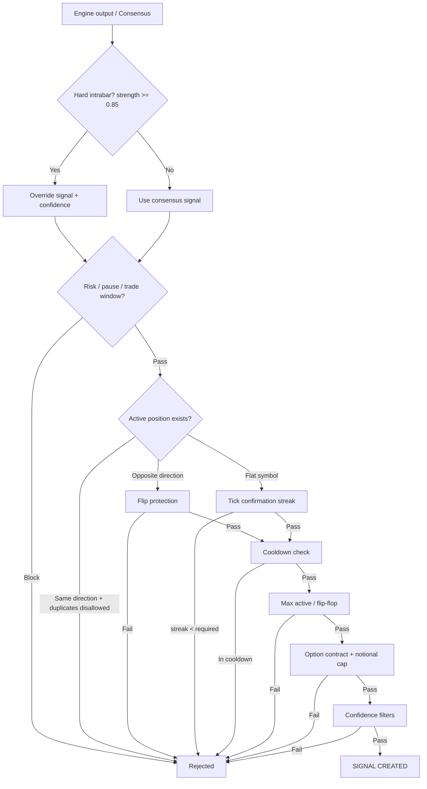

# OSI Signal Creation Flow — Review Document

> **Purpose:** Share this file with ChatGPT (or any reviewer) to validate the signal-creation decision tree against the live OSI codebase.
>
> **Primary implementation:** `osi/services/signal_manager.py` → `SignalManager.process_consensus()`
>
> **Entry point:** `osi/services/pipeline.py` builds `ConsensusOutput` via `ConsensusEngine.combine()` and passes each tick + consensus into `process_consensus()`.

---

## Flowchart (Decision Tree)



---

## High-Level Pipeline

```
MarketTick (index LTP + option chain + candle meta)
    │
    ▼
Multiple engines run (intrabar, scalping, trend, mean_reversion, smart_breakout, etc.)
    │
    ▼
ConsensusEngine.combine()  →  ConsensusOutput { signal, confidence, engine_outputs, selected_engine }
    │
    ▼
SignalManager.process_consensus(tick, consensus)  →  SignalRecord | None
    │
    ├── None  → rejected (reason stored in rejected_signals + metrics)
    └── SignalRecord  → active_signals[], Telegram notify, persist to storage/signals.json
```

---

## Step-by-Step Gate Reference

Each gate below maps 1:1 to code in `process_consensus()`. Rejection reason strings are what appear in logs, metrics, and `storage/signals.json`.

### A — Engine Output / Consensus

| Field | Source |
|-------|--------|
| `consensus.signal` | `BUY_CE`, `BUY_PE`, or `NONE` |
| `consensus.confidence` | Weighted confidence 0–100 |
| `consensus.engine_outputs` | List of per-engine `{ engine, signal, strength, confidence, reason }` |
| `consensus.selected_engine` | Winning engine from consensus selection |

**Consensus selection logic** (`osi/engines/consensus_engine.py`):
- Filter directional outputs (`BUY_CE` / `BUY_PE`)
- Pick highest strength engine, weighted by market phase
- Confidence = engine confidence × phase weight

---

### B/C — Hard Intrabar Override

**Condition:** Any `intrabar_engine` output with `signal != NONE` and `strength >= 0.85`

```python
# _is_hard_intrabar_override()
row.engine == "intrabar_engine" and row.signal != "NONE" and row.strength >= 0.85
```

**When true:**
- Overrides `consensus.signal` and `consensus.confidence` from the intrabar row
- Applies market-phase engine weight to confidence
- Sets `lead_engine = "intrabar_engine"`
- **Bypasses** later soft filters: none-signal check, confidence boosts/penalties block, premium filter, stale option data, entry filter
- **Does NOT bypass:** manual pause, risk gates, trade window, duplicate active, flip protection, tick confirmation (on flat), cooldown, max active, flip-flop, option contract lookup, notional cap, `min_signal_confidence`

**Note:** `hard_intrabar` also reduces required tick confirmation streak (see H).

---

### D — Use Consensus Signal (non-hard-intrabar path)

When **not** hard intrabar and `execution_only = True` (current default in code):

| Check | Rejection reason |
|-------|------------------|
| `consensus.signal == NONE` | `no_signal` |
| Aggressive fallback fails (mode != aggressive) | `none_signal` |
| `base_confidence < 10` | `low_base_confidence` |

When `execution_only = False` (legacy path, currently disabled):
- Mean reversion throttled in TRENDING regime → `mean_reversion_throttled_trending`
- Full confidence boost/penalty pipeline runs before contract selection
- Premium range, stale option data, entry filter all active

---

### E — Risk / Pause / Trade Window

| Gate | Condition | Rejection reason |
|------|-----------|------------------|
| Manual pause | `manual_pause == True` (Telegram `/pause`) | `manual_pause` |
| Risk blocked | `risk_gates_enabled` AND (daily PnL ≤ −cap OR consecutive SL ≥ max) | `risk_blocked` |
| Trade window | IST time NOT in 09:15–15:30 | `outside_trade_window` |

**Risk settings (env):**
- `OSI_RISK_GATES_ENABLED` (default `true`)
- `OSI_DAILY_LOSS_CAP` (default `3000`)
- `OSI_MAX_CONSECUTIVE_SL` (default `3`)

---

### F — Active Position Exists?

Only evaluated when `allow_duplicate_active == False`.

| Scenario | Behavior |
|----------|----------|
| **Same direction** as existing active position | Reject → `duplicate_active` |
| **Opposite direction** | Go to flip protection (G) |
| **Flat** (no active position) | Go to tick confirmation (H) |

When `allow_duplicate_active == True`: skips duplicate, flip protection, flip-flop, and max-active gates entirely.

---

### G — Flip Protection (Opposite Direction)

Closes existing position and allows new signal only if **replacement_ok**:

```
immediate_flip = strength >= 0.92 AND confidence >= 85
strong_flip    = strength >= 0.85 AND confidence >= 75
age_ok         = trade_age_sec >= 120s OR immediate_flip
replacement_ok = immediate_flip OR (streak >= required_ticks AND strong_flip AND age_ok)
```

| Result | Action |
|--------|--------|
| Pass | Close old signal (`OPPOSITE_SIGNAL_REPLACED`), set `bypass_cooldown = True` |
| Fail | Reject → `flip_protection` |

**Constants (hardcoded in SignalManager):**
- `flip_min_strength = 0.85`, `flip_min_confidence = 75`
- `flip_extreme_strength = 0.92`, `flip_extreme_confidence = 85`
- `min_hold_seconds = 120`

---

### H — Tick Confirmation Streak (Flat Symbol Only)

Counts consecutive ticks where consensus signal stayed the same direction (`BUY_CE` or `BUY_PE`).

**Required streak** (`_required_tick_confirmation(strength)`):

| Directional strength | Required consecutive ticks |
|---------------------|----------------------------|
| ≥ 0.85 | 1 |
| ≥ 0.75 | 2 |
| else | 3 |

| Result | Action |
|--------|--------|
| `streak < required` | Reject → `tick_confirmation_failed` |
| `streak >= required` | Continue to cooldown |

**Important:** Flip path (G) also requires `streak >= required_ticks` unless `immediate_flip`.

---

### I — Cooldown Check

| Condition | Rejection reason |
|-----------|------------------|
| `cooldown_seconds > 0` AND time since last signal < cooldown AND NOT `bypass_cooldown` | `cooldown` |

**Env:** `OSI_COOLDOWN_SECONDS` (default `120`)

Flip replacement sets `bypass_cooldown = True` so a validated flip is not blocked by cooldown.

---

### J — Max Active / Flip-Flop

**Max active per symbol:**
```
len(active_positions) >= max_active_per_symbol  →  max_active_limit
```
**Env:** `OSI_MAX_ACTIVE_PER_SYMBOL` (default `1`)

**Flip-flop guard** (alternating direction too quickly):
```
NOT hard_intrabar
AND NOT allow_duplicate_active
AND flip_flop_seconds > 0
AND last_side != current_signal
AND last signal was within flip_flop_seconds
AND abs(current_conf - last_conf) < flip_flop_conf_gap
→ flip_flop_guard
```

**Env:**
- `OSI_FLIP_FLOP_SECONDS` (default `150`)
- `OSI_FLIP_FLOP_CONF_GAP` (default `12`)

---

### K — Option Contract + Notional Cap

**Contract selection** (`_select_option_contract`):
1. Pick expiry via `ExpiryEngine`
2. Find ATM strike from option chain
3. Offset strike by lead engine (intrabar=ATM, zero_hero=±150, trend/ml=±100, others=±50)
4. Return CE/PE leg LTP + token

| Failure | Rejection reason |
|---------|------------------|
| No chain / expiry / strike / LTP | `option_contract_unavailable` |
| `notional = qty × option_ltp > max_trade_notional_rupees` | `notional_cap_exceeded` |

**Notional env:** `OSI_MAX_TRADE_NOTIONAL_RUPEES` (default `0` = disabled)

**Additional filters when `execution_only = False`:**
- Premium not in ₹20–₹200 → `premium_filter_blocked`
- Option data latency > `option_data_stale_sec` → `stale_option_data`

**Current runtime:** `OSI_OPTION_DATA_STALE_SEC=2.0`

---

### L — Confidence Filters

**Confidence adjustment** (skipped entirely for hard intrabar):

| Component | Value |
|-----------|-------|
| Primary boost (intrabar / smart_breakout trigger) | +10 |
| Directional boost | min(12, strength × 12) |
| VWAP aligned / misaligned | +6 / −6 |
| Regime boost (sideways+meanrev OR trending+breakout) | +4 |
| Option momentum penalty | −5 to −7 |
| Intrabar refire penalty (< 30s since last) | −7 |
| Dead zone penalty (low market activity) | −3 |
| No-trade soft zone (opening/closing windows) | −10 |

**Final rejection checks:**

| Check | Rejection reason |
|-------|------------------|
| Soft zone AND final < 35 | `no_trade_zone_confidence` |
| final < `min_signal_confidence` | `below_min_signal_confidence` |
| (non-hard, non-execution-only) final < 25 without primary trigger | `low_final_confidence_no_primary` |
| zero_hero engine AND final < 80 | `zero_hero_needs_high_confidence` |
| (non-primary) final < 25 AND strength < 0.7 | `no_primary_or_strong_base` |
| Entry filter fails (execution_only=False only) | `entry_filter_failed` |

**Env:** `OSI_MIN_SIGNAL_CONFIDENCE` (default `40`; current runtime `55`)

**Entry filter checks** (when active, mode=`confirmed` requires ALL pass):
- `price_confirmation` — index broke prev high/low + candle direction
- `option_momentum` — option premium moving with signal
- `range_expansion` — current candle range ≥ 105% of previous
- `vwap_alignment` — index on correct side of VWAP
- `rr_validation` — reward/risk ≥ 1.2

**Env:** `OSI_SCALPING_ENTRY_MODE` (`confirmed` | `aggressive`; aggressive needs 3/5 checks)

---

### M — SIGNAL CREATED

Creates `SignalRecord` with:
- Unique ID `OSI-{uuid}`
- Entry price = option LTP
- SL / T1 / T2 / T3 targets (strategy-dependent)
- Quantity from lots × lot size (NIFTY: 20×65, SENSEX: 20×20)
- Status `CONFIRMED`, lifecycle event `CREATED`
- Telegram notification + metrics increment

---

## Complete Rejection Reason Catalog

| Reason | Stage |
|--------|-------|
| `manual_pause` | E |
| `risk_blocked` | E |
| `outside_trade_window` | E |
| `mean_reversion_throttled_trending` | D (execution_only=False) |
| `no_signal` | D |
| `none_signal` | D |
| `low_base_confidence` | D |
| `duplicate_active` | F |
| `flip_protection` | G |
| `tick_confirmation_failed` | H |
| `cooldown` | I |
| `max_active_limit` | J |
| `flip_flop_guard` | J |
| `option_contract_unavailable` | K |
| `notional_cap_exceeded` | K |
| `premium_filter_blocked` | K |
| `stale_option_data` | K |
| `no_trade_zone_confidence` | L |
| `below_min_signal_confidence` | L |
| `low_final_confidence_no_primary` | L |
| `zero_hero_needs_high_confidence` | L |
| `no_primary_or_strong_base` | L |
| `entry_filter_failed` | L |

---

## Current Runtime Configuration (Example)

From a live session on port 8011:

```
OSI_MIN_SIGNAL_CONFIDENCE=55
OSI_SCALPING_ENTRY_MODE=confirmed
OSI_OPTION_DATA_STALE_SEC=2.0
OSI_ALLOW_DUPLICATE_ACTIVE=false
OSI_MAX_ACTIVE_PER_SYMBOL=1
OSI_COOLDOWN_SECONDS=120
OSI_FLIP_FLOP_SECONDS=150
OSI_RISK_GATES_ENABLED=true
```

**Code flag:** `execution_only = True` inside `process_consensus()` — this is the dominant mode and skips several legacy soft filters (premium, stale data, entry filter, mean-reversion throttle). Hard intrabar and the position-management gates still apply.

---

## Questions for Reviewer (ChatGPT)

1. **Ordering:** Is cooldown checked before or after flip replacement bypass? (Answer: after flip; flip sets `bypass_cooldown`.)
2. **Tick confirmation on flips:** Should `immediate_flip` skip tick streak requirement? (Currently: yes for extreme strength/conf; otherwise streak required.)
3. **Hard intrabar bypass scope:** Should hard intrabar also bypass `min_signal_confidence` and tick confirmation? (Currently: NO — still subject to both.)
4. **execution_only=True:** Is it intentional that premium filter, stale option data, and entry filter are disabled in production?
5. **Flip-flop vs flip protection:** Are these redundant or complementary? (Flip protection = active position replacement; flip-flop = post-close direction alternation guard.)
6. **Confidence floor 55 with execution_only:** With boosts/penalties skipped for hard intrabar, is raw intrabar confidence always ≥ 55?
7. **Missing gate in flowchart:** Should `no_trade_soft_zone` penalty (−10 confidence) appear as an explicit node before confidence filters?

---

## Key Code Locations

| Component | File | Function |
|-----------|------|----------|
| Main decision tree | `osi/services/signal_manager.py` | `process_consensus()` |
| Hard intrabar detection | same | `_is_hard_intrabar_override()` |
| Tick streak | same | `_update_direction_streak()`, `_required_tick_confirmation()` |
| Flip logic | same | lines ~281–334 |
| Contract pick | same | `_select_option_contract()` |
| Risk gates | same | `_risk_blocked()` |
| Consensus build | `osi/engines/consensus_engine.py` | `combine()` |
| Settings | `osi/core/config.py` | `OSISettings` |
| Rejected signal storage | `storage/signals.json` | `rejected_signals[]` |

---

## ASCII Summary (Compact)

```
CONSENSUS IN
  ├─ hard intrabar (strength≥0.85)? → override signal/confidence
  ├─ manual_pause? ──────────────────────────────→ REJECT
  ├─ risk_blocked? ──────────────────────────────→ REJECT
  ├─ outside 09:15-15:30 IST? ─────────────────→ REJECT
  ├─ signal NONE (non-hard)? ────────────────────→ REJECT
  ├─ active same direction? ─────────────────────→ REJECT (duplicate_active)
  ├─ active opposite?
  │     ├─ flip criteria met? → close old, bypass_cooldown
  │     └─ else ─────────────────────────────────→ REJECT (flip_protection)
  ├─ flat + streak < required? ──────────────────→ REJECT (tick_confirmation_failed)
  ├─ in cooldown (no bypass)? ───────────────────→ REJECT (cooldown)
  ├─ max active reached? ────────────────────────→ REJECT (max_active_limit)
  ├─ flip-flop guard? ───────────────────────────→ REJECT (flip_flop_guard)
  ├─ no option contract? ────────────────────────→ REJECT (option_contract_unavailable)
  ├─ notional cap exceeded? ─────────────────────→ REJECT (notional_cap_exceeded)
  ├─ confidence < min_signal_confidence? ────────→ REJECT (below_min_signal_confidence)
  └─ PASS ───────────────────────────────────────→ SIGNAL CREATED
```

---

*Generated from OSI codebase — `SignalManager.process_consensus()` as of June 2026.*
